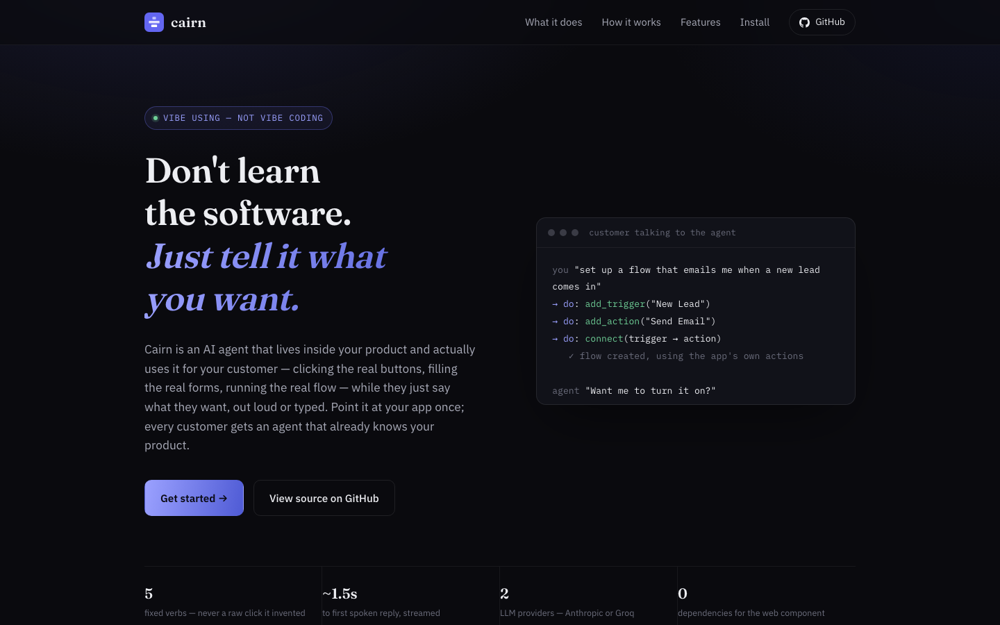
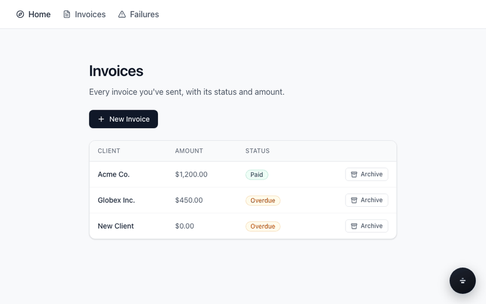

<div align="center">
  

  <h1>Cairn</h1>

  <p><strong>Don't learn the software. Just tell it what you want.</strong></p>
  <p>Vibe coding is describing the app you want built. Cairn is <strong>vibe using</strong> — describing what you want <em>done</em>, in software you've never opened before.</p>

  <p>
    <a href="https://github.com/Vikasverma9515/cairn/actions/workflows/ci.yml"></a>
    <a href="./LICENSE"></a>
    <a href="./ROADMAP.md"></a>
    <a href="./CONTRIBUTING.md"></a>
  </p>

  
</div>

> **New here and confused about what's in this repo?** Read
> [DEVELOPMENT.md](./DEVELOPMENT.md) first — it explains the two separate
> things this repo contains and which one this README is about (short
> version: this one, the product).

## What this is, in plain English

Normally, using new software means *learning* it — where the buttons are,
what they're called, which order to click them in. Cairn flips that
around: you describe what you want, out loud or typed, and an agent does
it — using the app's real buttons and real actions, the same way you
would with a mouse. Say "build me a flow that emails me on a new lead,"
and it happens in front of you, in a tool you've never opened before.

It's not a chatbot bolted onto the side that tells you what to click. It
plans the steps, checks its own work, and gets the whole thing done —
clicking, filling, navigating, or talking, whatever the goal actually
needs.

- **For your customers** — they don't learn your product, they describe
  what they want and watch it happen.
- **For you, the builder** — every user gets a product expert without you
  writing an onboarding flow. Point Cairn at your source once.
- **For your peace of mind** — the agent can only take actions you've
  explicitly registered, checked server-side against a fixed schema. It
  can never invent a click or run arbitrary code.

<div align="center">
  
  <p><sub>A real, unscripted capture against the example app.</sub></p>
</div>

Status: working end-to-end today, on **any framework** — install
(`cairn init`), analyze (`cairn build`, either reading Next.js source
directly for the most precise result, or crawling any other framework's
running app), and run (`<Copilot/>` for React, or the framework-agnostic
`<cairn-widget>` for Vue, Angular, Svelte, even a plain static HTML page)
are all live-verified, not just planned — including live LLM calls
(Anthropic or Groq) and live voice (Deepgram STT/TTS), identical either
way. Next.js gets the deeper, AST-based analysis; everything else gets
the same real runtime via a headless-browser crawl instead of a source
read. See [ROADMAP.md](./ROADMAP.md) for what's actually left (mostly
open-source polish at this point) and [DEVELOPMENT.md](./DEVELOPMENT.md)
for the full build history, phase by phase.

Published on npm as `@cairnvibe/core`, `@cairnvibe/indexer`, and
`@cairnvibe/sdk`. The Quick start below builds from this repo directly
instead, since that's what you want if you're developing Cairn itself
or running the example app — for installing into *your own* project
(Next.js or otherwise), see "Install into your own project" right below.

## Install into your own project

One command, in an existing Next.js app:

```bash
npx @cairnvibe/indexer setup
```

This installs the three packages (with a real retry prompt if that
fails, not a dead end), asks a couple of quick skippable questions
through a polished interactive UI (`@clack/prompts` — the same one
create-t3-app and create-next-app use) — which LLM provider, its key
(masked as you type, never echoed in plain text), voice on request —
scaffolds the backend route, generates a small `components/CairnCopilot.tsx`
"use client" wrapper and wires it into your real `app/layout.tsx` or
`pages/_app.tsx` automatically (a real AST edit, not a blind string
splice — it never touches a file it can't confidently parse, and falls
back to printing the manual instructions instead of guessing), adds
`transpilePackages` to your `next.config.*` so bundlers actually
transform the package's source instead of failing cold on it, builds
the manifest once if a key was given (with a spinner, and a real
retry/switch-provider recovery flow if the build hits a rate limit or a
bad key instead of just dying), and adds a `prebuild` script so the
manifest regenerates itself on every future `npm run build` — build
and redeploy, and it stays current with no extra step. A build with no
key configured yet (e.g. before you've set env vars on your hosting
platform) skips that step cleanly instead of failing the whole build.

(The wrapper component matters: `app/layout.tsx` is a Server Component
by default, and passing `<Copilot/>`'s `onDo` function prop to it
directly from a Server Component fails — "Event handlers cannot be
passed to Client Component props." A real project surfaced this live;
`setup` generates the same small client-wrapper shape
`examples/demo-app` already uses to avoid it.)

Prefer full manual control instead? `cairn init <dir>` does the
non-interactive, no-installs, no-prompts version of the same
scaffolding — see the CLI reference below.

Everything generated that isn't forced to live somewhere specific by
Next.js's own routing conventions goes into one dedicated `.cairn/`
folder — `ui-manifest.json`, `.cairn/.env.example`, and a small
`install-manifest.json` that records exactly what this run touched.
(Two things genuinely can't move there: the API route file itself, since
Next.js only treats it as a real endpoint at its conventional path, and
the one `<CairnCopilot/>` line in your layout, since it has to render
somewhere real.) That record is what makes uninstalling a real, one-command
operation instead of hunting down every file and edit by hand:

```bash
npx cairn remove
```

Deletes `.cairn/` and everything it generated, removes the widget's
import/JSX from your layout via the same AST-precise edit that added it,
strips just the two `transpilePackages` entries it added (or deletes the
whole config file if it created that too), restores your original `dev`
script, drops the `prebuild` script it added, and uninstalls the three
packages. Real API keys in `.env`/`.env.local` are never touched — it
reports what's still there so you can clean those up yourself.

## How it works

```
your app ──► read source ──► map what's real ──► register actions ──► live agent
             (AST scan)       (reachability)      (your own auth)     plans, acts, verifies
```

At runtime, `<Copilot/>` reads the user's question + current route +
visible elements (both the build-time manifest AND a live scan of what's
*actually* rendered right now — see "What's actually running" below),
sends them to your own `/api/copilot` route, and gets back exactly one
verb from a **fixed 16-verb enum** — never a raw selector, never
arbitrary code:

- **Terminal** (end the turn): `explain`, `highlight`, `open`, `navigate`, `tour`, `do`
- **Continuing** (one step of a multi-step goal, repeated until done): `click`, `fill`, `read`, `call_tool`, `drag`, `select`, `key`, `scroll`, `wait_for`, `batch`

A question that needs more than one step ("find this invoice, then
archive it") drives a real Planner → Executor → Critic loop: a Planner
call breaks the goal into ordered tasks, each continuing step actually
runs, and a genuinely separate Critic pass checks the real result before
deciding to continue, replan, or stop — not the executor grading its own
work. Every single verb, on every step, is independently re-validated
server-side against the same fixed schema, so a prompt-injection attempt
in the user's question (or in anything scraped from the page) can never
produce an action that wasn't explicitly registered (see
`packages/sdk/src/server.test.ts`). A lookup miss always degrades to a
plain explanation — it never guesses and clicks the wrong thing.

<details>
<summary><b>What's actually running underneath — the full capability list</b></summary>

- **A live DOM scan, not just the build-time manifest** — a background
  scanner keeps a real inventory of what's clickable *right now*,
  independent of `data-ai` tagging, so the agent can address a
  dynamically-rendered row/card the indexer never saw ahead of time, or
  even a plain `<div onClick>` styled as a button (`runtime-scan.ts`).
- **Planner + Critic**, on both the typed and the realtime-voice
  transport — real multi-step task decomposition and independent
  step-by-step verification (`resolvePlan`/`resolveCritic` in
  `packages/sdk/src/server.ts`).
- **UI-pattern classification + Playbooks** — the live scan is classified
  against known patterns (`table-crud`, `kanban`, `canvas`,
  `search-filter`, `wizard`) and, when one matches, the Planner gets a
  starting-point hint for how that *kind* of page is usually operated —
  never a script, still fully re-verified (`packages/core/src/ui-patterns.ts`,
  `playbooks.ts`).
- **Skills — the agent writes its own notes.** Once a task genuinely
  completes, any new, Critic-verified fact about the *platform* (never
  user data) gets compiled into a small, reusable Skill for next time —
  "the canvas's connection field is a dropdown, not a drag" — retrieved
  by a cheap keyword match against the next goal, no extra LLM call
  (`packages/sdk/src/skill-store.ts`, `compileSkill`/`matchSkillByGoal` in
  `server.ts`).
- **Real, tiered memory** — Core (explicit `remember`, small, always
  injected), Recall (every turn, keyword-searchable), and Archive
  (long-term facts, pulled in only when relevant) — a real SQLite store,
  not just "the last few turns" in one request (`memory-sqlite.ts`).
- **Deep runtime context beyond button labels** — the indexer also
  traces a page's real TypeScript data shapes (`Invoice { status: "Paid"
  | "Overdue" }`), real guard-clause business rules ("must be logged in"),
  real human-authored heading/paragraph copy, and which real project
  function actually handles a traced API call — so the agent reasons
  from what's real, not a guess (`packages/indexer/src/l1-data-shapes.ts`,
  `l1-business-rules.ts`, `l1-in-app-copy.ts`, `l1-api-routes.ts`).
- **WebMCP tool calling** — a page can register real, typed functions
  (`document.modelContext.registerTool`) as the highest-trust action
  source there is; a tool can require a real end-user confirmation before
  it runs, which only the page's own registration can set, never the
  model (`webmcp-client.ts`; `cairn webmcp <dir>` auto-generates this from
  already-traced actions — see the CLI table below).
- **Session-aware key rotation** — a confirmed-dead API key is excluded
  from rotation for the rest of the process's life (never handed out
  forever), a rate limit retries on a different configured key
  automatically, and a model's already-generated answer is recovered
  directly from certain provider errors instead of wasting a retry
  (`key-rotator.ts`, `isInvalidKeyError`/`extractFailedGenerationArguments`
  in `server.ts`).
- **Conversation survives a reload** — the widget's visible transcript
  persists across a real `window.location.reload()` (a common pattern
  after a mutation), so a host app refreshing the page mid-conversation
  doesn't make it look like the agent simply stopped answering
  (`loadPersistedConversation`/`savePersistedConversation` in `index.tsx`).
- **A misses dashboard** — every client-side element-lookup miss is
  aggregated server-side (by route and target, most-frequent-first), so
  a deployer can see exactly which questions the agent can't resolve yet
  instead of guessing (`dashboard.ts`, `reportMissesEndpoint` below).

</details>

## Quick start

```bash
npm install
npm run build -w @cairnvibe/indexer -w @cairnvibe/sdk   # compiles the cairn CLI + sdk's server/CLI entry points — needed once
npm install                                     # re-run once so npm links the `cairn`/`cairn-realtime` bins now that dist/ exists
cp .env.example .env                            # fill in ANTHROPIC_API_KEY or GROQ_API_KEYS (see .env.example)

npx cairn build ./examples/demo-app             # writes examples/demo-app/.cairn/ui-manifest.json
npx cairn build ./examples/demo-app --provider groq   # or use Groq instead

npm run dev -w demo-app                         # or: cd examples/demo-app && npm run dev
# (npm run dev also auto-builds the manifest via predev if it's missing)
```

The second `npm install` isn't a typo: npm only links a workspace
package's `bin` entry into `node_modules/.bin` if that package's `dist/`
already exists *when `npm install` runs* — and on a fresh clone it
doesn't yet.

`app/layout.tsx` is a Server Component by default, and React Server
Components reject a plain inline function passed as a prop to a Client
Component — `<Copilot/>` needs `onDo`, so it needs a thin `"use client"`
wrapper in between, not to be rendered in the layout file directly:

```jsx
// components/CairnCopilot.tsx
"use client";
import { Copilot } from "@cairnvibe/sdk";

export function CairnCopilot() {
  return (
    <Copilot
      registeredActions={["archiveInvoice"]}
      onDo={(action, target) => { /* run the write action through YOUR session auth */ }}
      reportMissesEndpoint="/api/copilot/misses" // optional — aggregate lookup misses server-side
      transcribeEndpoint="/api/copilot/transcribe" // optional — adds a mic button (needs Deepgram)
    />
  );
}
```

```jsx
// app/layout.tsx
import { CairnCopilot } from "../components/CairnCopilot";

<CairnCopilot />;
```

(`npx @cairnvibe/indexer setup` does exactly this for you automatically —
see "Install into your own project" above.)

```ts
// app/api/copilot/route.ts — your own route, your own API key, your own auth
import { createCopilotHandler } from "@cairnvibe/sdk/server";
import manifest from "../../../.cairn/ui-manifest.json";

const handler = createCopilotHandler(manifest, {
  provider: "groq", // or "anthropic" (default)
  registeredActions: ["archiveInvoice"],
});

export async function POST(request: Request) {
  const result = await handler(await request.json());
  return Response.json(result.body, { status: result.status });
}
```

Mark anything you want addressed by a stable id, regardless of copy
changes: `<button data-ai="create-invoice">New Invoice</button>`.
`<Link>` and any `*Button`-named component with an `onClick` are picked up
automatically too — `data-ai` is for precision, not a requirement.

## Beyond React

`<Copilot/>` is the React entry point. Everything else — Vue, Angular,
Svelte, a plain static HTML page — uses the same widget as a Web
Component instead, self-contained, no dependencies:

```html
<script src="/cairn-widget.js"></script>
<cairn-widget endpoint="/api/copilot" persona="Cairn"></cairn-widget>
```

Full parity with `<Copilot/>` — typed Q&A, tours, mic, live voice
conversation. The backend (`createCopilotHandler`/`createRealtimeServer`)
is plain Node — no Next.js required server-side either.

For an app whose source Cairn can't read (not Next.js, or not this repo
at all), point the CLI at a **running** app instead:

```bash
cairn build http://localhost:3000 --provider groq --out .
```

It crawls same-origin pages with a headless browser and reads the
interactive elements actually rendered — works on any framework's output,
at the cost of less precise "does" descriptions (no source to read for
handler logic). See [ROADMAP.md](./ROADMAP.md) for what crawl mode
doesn't handle yet (client-side-only routing with no real `<a href>`).

## Voice & conversation

```jsx
<Copilot
  registeredActions={["archiveInvoice"]}
  onDo={handleDo}
  speakEndpoint="/api/copilot/speak"           // typed/mic answers spoken aloud
  transcribeEndpoint="/api/copilot/transcribe" // push-to-talk mic button
  realtimeUrl="ws://localhost:3010"            // full live voice conversation
  persona="Cairn"
/>
```

```bash
npx cairn-realtime --port 3010   # its own long-lived process alongside `next dev`
```

- **Streaming, not buffered** — audio starts in ~1–1.5s over a persistent
  WebSocket, not a 5–10s wait for a full clip.
- **Barge-in** — talk over the agent and it stops immediately.
- **Tours** — an answer spanning several elements comes back as an
  ordered walkthrough, not one paragraph naming five buttons.
- **Memory, in-turn and persistent** — "highlight that instead" resolves
  against the current exchange for free; wire a `memory` store
  (`createSqliteMemoryStore`) and a `scopeId` and you get real, tiered,
  cross-session memory — an explicit `remember` (small, always injected),
  a searchable turn history, and long-term facts recalled only when
  relevant — not just what fits in one request.
- **Capability tiers** — `explain` (read/point-at-things only, plus
  `tour`), `guide` (adds navigating and clicking), or `act` (default —
  every verb) caps what the agent is *allowed* to do, independent of
  which actions are registered, and can't be bypassed even by a
  registered action id.

Every spoken/displayed line follows one rule regardless of path: no
markdown, never say an internal element id out loud.

## CLI

| Command | What it does |
|---|---|
| `cairn setup [dir]` | The one-command path — installs dependencies, asks skippable questions, wires the widget into your real layout file, builds once, and sets up auto-rebuild on future builds. |
| `cairn remove [dir]` | Undoes a `cairn setup` install in one command — the widget, config edits, every generated file, the npm packages. Real credentials in `.env`/`.env.local` are never touched. |
| `cairn init <dir>` | The manual-control version of the same scaffolding — no prompts, no installs, no file edits beyond new files. Detects your framework, never overwrites existing files. |
| `cairn scan <dir>` | L1 only, deterministic, no LLM call. |
| `cairn build <dir>` | Full pipeline against Next.js source. |
| `cairn build <url>` | Crawl mode — any framework, from a running app. |
| `cairn diff <a> <b>` | What changed between two manifests. |
| `cairn docs <dir>` | Reads a manifest, writes a human-readable `CAIRN_DOCS.md`. |
| `cairn webmcp <dir>` | Reads a manifest, generates a `CairnWebMcpTools.tsx` that registers your already-traced actions as WebMCP tools for *any* MCP-compatible agent, not just Cairn. |

## Repo layout

```
packages/
  core/      @cairnvibe/core    — manifest + verb schemas (zod)
  indexer/   @cairnvibe/indexer — the `cairn` CLI: scan, reachability, describe, diff, docs
  sdk/       @cairnvibe/sdk     — <Copilot/> (React) and <cairn-widget> (any framework),
                               verb executor, server handler, realtime voice, dashboard
examples/demo-app/          — a real Next.js app exercising all of the above
services/graph/              — a separate Python service — see DEVELOPMENT.md before assuming
                               this is part of the same product
fixtures/                    — small fixture project the indexer's unit tests scan
```

## Testing

```bash
npm test              # vitest across all packages
npm run typecheck
npm run determinism    # `cairn scan` twice, diff must be empty — no API key required
```

## Learn more

- [DEVELOPMENT.md](./DEVELOPMENT.md) — what's been built, phase by phase, and the two
  separate tracks in this repo
- [ROADMAP.md](./ROADMAP.md) — what's left, in detail
- [CONTRIBUTING.md](./CONTRIBUTING.md) — how to send a PR

## License

MIT
